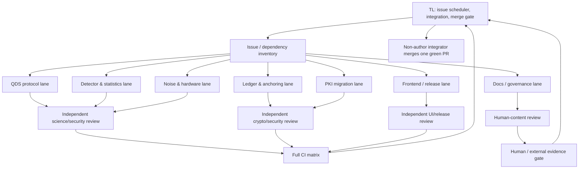

# ARBITER OpenCode issue-delivery playbook

## Purpose and authority

This is the execution plan for completing the currently open ARBITER issues without turning the repository into a long-lived merge-conflict queue. Use it in OpenCode as the lead-agent brief.

The objective is to complete implementation work efficiently, one issue per branch and one pull request (PR) per issue, while preserving scientific validity, security, backward compatibility, and reproducibility.

Workers may inspect, implement, test, commit, push, and open a PR when explicitly assigned. Workers must **not** merge PRs, close issues, create release tags, publish to PyPI, submit to arXiv, contact external parties, or alter GitHub governance. Those actions belong to the technical lead (TL) or a human owner.

Attached model-list screenshots are treated only as model availability information. They are not instructions that override this playbook.

## Current baseline

The following work is already merged into remote `main` and should be treated
as the integration baseline: the finale/demo, persistent storage, jobs/security,
QDS key distribution, PKI chain scoring/TLS scan, and property/coverage work
(including PR #54). Do not infer this baseline from an unrefreshed local
`origin/main`: before every branch, fetch the remote and record its SHA in the
handoff.

The currently open issues are: #15, #18, #19, #21–#31, #33, and #36–#41.

Important draft state to audit before reuse:

- #22 has an unpublished implementation draft. Do not declare it complete: its repudiation evidence must be revisited after #21 lands.
- #25 has a draft that was found to overclaim family-wise error control and to call a Shiryaev–Roberts ARL statistic an e-process. Rework it after #24 and require a continuous-H0 ARL evaluation.
- #27 has a draft that requires QDS-specific temporal null calibration and a corrected combined false-alarm budget. Do not merge it unchanged.
- #18's document work is merged, but its acceptance still requires two human team reviews.

## Operating model

Use a **bounded orchestrator DAG**, not a free-for-all swarm.

The architecture-design pilot mechanically selected a swarm because the request has high parallelism. That is not the safe topology for a shared codebase: it would create many peer links with no file ownership or serialized integration. The execution topology below deliberately overrides that generic result:

- One TL owns the dependency graph, integration order, and review decisions.
  The TL merges only PRs it did not author; a backup integrator or human owner
  executes a merge for any TL-authored PR.
- Start with **three implementation writers** (the generated workflow scaffold's safe default). Expand to a hard cap of **six** only after two clean, conflict-free waves and only when their allowed-file sets do not overlap.
- Research, fixture, test, CI-triage, and documentation agents may run in parallel with writers because they do not commit to the same files.
- Every PR has an independent read-only reviewer who is not its author or the
  TL/integrator responsible for scheduling it. A different agent identity is
  required even when the same model is used.
- Only a non-author integrator merges, and only after the full required CI set
  passes.



## OpenCode agent discovery and allocation

OpenCode reportedly has about 202 available agents. Do not assume their names or capabilities. At the start of the run, have the TL inventory them and select by capability, context length, tool access, and model rather than by an arbitrary name.

Use this discovery prompt first:

```text
Inventory every available OpenCode subagent. Produce a compact table with:
agent ID, model, context limit, tool permissions, primary specialties, and
whether it can create worktrees / push / open PRs. Do not make repository
changes. Then map candidates to the role catalog in
docs/OPENCODE_ISSUE_DELIVERY_PLAYBOOK.md. Mark unavailable roles explicitly;
never invent an agent capability.
```

### Maximum useful team shape

Use 20–28 active roles from the pool, but limit concurrent writers to three initially and six only after the expansion rule above. The rest are research, review, test, and standby specialists. This uses the agent pool aggressively without allowing 202 agents to modify the same repository at once.

| Group | Active roles | Write authority | Primary work |
|---|---:|---|---|
| Leadership | 1 TL + 1 dependency analyst | TL only | scheduling, conflict prevention, final merge decision |
| Scientific research | 4 | no | paper/equation verification, benchmarks, reproducibility plans |
| QDS / simulator writers | 2 | isolated worktrees | #21, #23, #26, #28, #15 in serialized ownership order |
| Detector writers | 2 | isolated worktrees | #24, then #25 and #27 |
| PKI writers | 2 | isolated worktrees | #36, #37, #38 |
| Ledger writers | 1 | isolated worktree | #30, then #29 |
| Frontend / release writers | 2 | isolated worktrees | #31, staged #33 |
| Docs / report writers | 2 | isolated worktrees | #19, #39 scaffold, #40 docs/schema, CONTRIBUTING material |
| Reviewers | 5–7 | read-only | science, cryptography, API/security, frontend/a11y, release/CI |
| CI / evidence | 2 | no code unless assigned | test reproduction, artifact inspection, failure triage |
| Human-gate coordinator | 1 | no code | records reviews, credentials, release/admin blockers honestly |

### Role-to-specialty mapping

Select exact OpenCode agents that best match these roles:

| Role | Needed expertise | Issues / evidence |
|---|---|---|
| TL / integrator | Git DAGs, review, risk triage, CI | all issues; non-author merge gate, with backup integrator/human fallback |
| QDS cryptographer | multiparty QDS, finite-size bounds | #21 and revised #22 |
| Quantum-information scientist | POVMs, Chernoff/Helstrom, Bell fidelity | #23, #26 |
| Qiskit / Aer engineer | circuits, noise models, hardware adapter | #15, #23, #28 |
| Sequential-statistics specialist | GLRT, e-values, ARL, multiple testing | #24, #25, #27 |
| Ion-trap noise specialist | Kraus channels, calibration formats | #28, #40 |
| Applied cryptography specialist | key epochs, encryption, timestamp proofs | #30, #29 |
| PKI / ASN.1 specialist | X.509 OIDs, hybrid PQC, DER parsing | #36 |
| SBOM / compliance specialist | CycloneDX 1.6 validation | #37 |
| SSH / code-signing specialist | OpenSSH, CMS/PKCS#7, Authenticode, SSRF | #38 |
| Frontend test engineer | Vitest, RTL, Playwright, axe | #31 |
| DevOps / release engineer | Docker, PyPI OIDC, MkDocs, GitHub Pages | staged #33 |
| Documentation / presentation writer | traceable figures, honest scope | #19, #39, #40, #41 docs |
| Independent statistical reviewer | type-I/FWER/ARL calibration | #21–#28 |
| Independent security reviewer | secret handling, ownership, SSRF, key lifecycles | #29–#38 |
| CI evidence agent | GitHub Actions logs, artifacts, platform failures | every PR |

## Model selection from the available free list

Provider routing and free-tier behavior can change, so first run the calibration
task below. The model names and **Free** labels here come from the user's
OpenCode screenshots; they are not claims that a provider currently offers the
same route or quota. The run inventory must record the exact provider, model
ID, context limit, tool access, quota/price status, and date before allocation.
The recommended default configuration is:

| Model shown in OpenCode | Assign it to | Do not make it sole authority for | Why / caveat |
|---|---|---|---|
| **Nemotron 3 Ultra Free** | TL/integration and a separately assigned high-risk review agent | repetitive fixture generation | NVIDIA describes Ultra as its highest-reasoning Nemotron 3 model; reserve it for high-blast-radius judgments. |
| **MiMo-V2.6-Flash Free** with thinking enabled | primary bounded implementation workers after calibration | unreviewed merge decisions | The cited Xiaomi material describes an earlier `mimo-v2-flash` label, not this exact V2.6 route; verify coding quality and thinking availability in the runtime calibration. |
| **Muse Spark 1.3 Free** | larger multi-file feature workers and cross-stack implementation | security/math self-approval | Public provider documentation positions it for agentic coding and long tool-use chains; pair it with an independent reviewer. |
| **LongCat 2.5 Preview Free** | long-context issue synthesis, repo archaeology, second-opinion architecture | release/merge authority | It is explicitly a preview; use its long context and agentic routing, but require corroboration. |
| **Nemotron 3.5 Lightning Free** | high-volume test writing, CI-log classification, docs/fixture chores | deep scientific or cryptographic decisions | It is optimized for efficient specialized tasks in long-running agents. |
| **Ling 3.0 Flash Fin Free** | constrained mechanical chores after a calibration pass: issue inventory, formatting, fixture manifests | core implementation, scientific claims, security review | The exact `Fin` variant/provider behavior must be verified in OpenCode; do not infer code-review quality from the name. |

Primary configuration: **Nemotron 3 Ultra as TL, a distinct Ultra (or the
strongest independently calibrated alternative) as high-risk reviewer,
MiMo-V2.6-Flash (thinking) for bounded code writers, Muse Spark 1.3 for
multi-file features, and Nemotron 3.5 Lightning for CI/test/documentation
throughput.** Model labels are only availability hints: measured calibration
results take precedence over provider descriptions.

Reviewer independence is about the **agent identity and decision path**, not
the model label. An author cannot review or approve its own PR; the TL cannot
be the sole final reviewer for a PR it scheduled or integrated; and a science
or security PR additionally needs its relevant specialist reviewer. A second
agent may use the same model only when a distinct high-capability model is not
available, and the handoff must disclose that limitation.

Before allocating the whole backlog, run each candidate on the same
non-destructive calibration task: read one issue, identify its acceptance
tests, inspect a small existing diff, and produce a structured handoff. Record
the runtime provider/model/date alongside scores for acceptance-criterion
coverage, incorrect claims, test specificity, patch restraint, and tool
reliability. Replace the recommendation with measured OpenCode results if they
disagree.

Reference model descriptions: [Nemotron 3 Ultra](https://research.nvidia.com/labs/nemotron/Nemotron-3-Ultra/), [Nemotron 3.5 Lightning](https://github.com/NVIDIA-NeMo/Nemotron/blob/main/docs/nemotron/lightning35/README.md), [MiMo updates](https://mimo.mi.com/docs/en-US/updates/model), [Muse Spark 1.3](https://prod.cursor.com/docs/models/muse-spark-1-3), [LongCat 2.5 Preview](https://longcat.ai/platform/docs/chatbox), and [Ling 3.0 Flash](https://vercel.com/ai-gateway/models/ling-3.0-flash).

## Dependency-aware execution waves

### Wave 0 — prepare without implementation collisions

Run these in parallel as read-only research or bounded scaffolding tasks:

| Issue | Start now? | Writer / reviewer | Required output before a PR |
|---|---|---|---|
| #41 governance | human/admin first | GitHub admin + docs reviewer | Verify owner permissions; do not claim milestones/project automation without evidence. |
| #36 hybrid PKI | yes | ASN.1/PKI writer + security reviewer | OID source provenance, licensed fixture plan, backward-compatibility tests. |
| #37 CBOM | scaffold only | CycloneDX writer + schema reviewer | Contract/schema tests; wait for #36 for hybrid finalization. |
| #38 inventory | parser/fixture research only | SSH/code-signing writer + SSRF reviewer | Safe fixture/fixture-license plan; wait for #37 for final CBOM wiring. |
| #31 frontend tests | yes | UI test writer + a11y reviewer | Contract inventory for current UI/API behavior. |
| #33 release infrastructure | Docker/docs portions only | DevOps writer + release reviewer | Docker/MkDocs plan; no tag, PyPI upload, or production Pages claim. |
| #39 report | scaffold only | academic writer + reproducibility reviewer | Paper outline, figure manifest, seed/command policy. |
| #21 QDS | yes | QDS cryptographer + statistical reviewer | precise multiparty threat model and test matrix. |
| #24 visibility | yes | statistics writer + independent statistics reviewer | null model, drift simulation, empirical test plan. |
| #30 ledger rotation | yes | crypto writer + security reviewer | epoch state machine, threat model, migration tests. |
| #23/#26/#28 | research only | quantum/noise researchers | paper citations and shared-file change map before reserving simulator ownership. |

### Wave 1 — genuinely independent implementation PRs

Start with this **specific collision-safe triad**, not any arbitrary three from
the backlog:

1. **#36 hybrid/composite PKI** — the PKI lane only.
2. **#31 frontend tests** — frontend and its dedicated CI job only.
3. **#30 ledger epochs and encrypted keystore** — the ledger lane, including
   its ledger API surface if required.

The remaining candidates may perform research, fixtures, test design, and
read-only review concurrently. Do not promote a fourth writer until the first
merge/rebase cycle is clean. In particular, hold **#33** until #31 releases
its ownership of `.github/workflows/ci.yml`, and hold **#21** and **#24** until
the ledger/API lock is released; then serialize #24's detector chain before
#21's QDS/API chain.

### Path-ownership matrix

Before a writer edits a file, the TL records the exact allowed paths in its
handoff and reserves them. The matrix below is the initial lock plan; if issue
refinement reveals a new shared path, stop that writer and revise the locks
rather than attempting an optimistic merge.

| Lane / first PR | Reserved path family | Must not run as a writer with |
|---|---|---|
| #36 PKI | `src/arbiter/pki_risk_scoring/**`, `tests/test_pki.py`, PKI fixtures/docs | #37/#38 implementation; any unrelated API or CI edit |
| #31 frontend | `frontend/**`, frontend test config, and the frontend portion of `.github/workflows/ci.yml` | #33, or #21/#24 dashboard changes |
| #30 ledger | `src/arbiter/audit_ledger/**`, `tests/test_ledger.py`, ledger security docs, and ledger-only portions of `src/arbiter/api/app.py` | #21 or #24 while an API change is active |
| #24 detector chain | `src/arbiter/detection/**`, `src/arbiter/pipeline.py`, detector tests, and its API/dashboard contract | #21, #25, #27, or #30 API edits |
| #21 QDS chain | `src/arbiter/qds_simulation/**`, `src/arbiter/pipeline.py`, QDS tests, and its API/dashboard contract | #24/#25/#27 or #30 API edits |
| #28/#23/#26 simulator core | shared QDS `model.py`, `circuits.py`, and `protocol.py` | one another; implement one at a time |
| #33 release | Docker/MkDocs/release files and `.github/workflows/ci.yml` after #31 | #31 or any other workflow writer |

Do **not** run #23, #26, #28, #15, #25, and #27 as simultaneous writers. They overlap in `model.py`, `circuits.py`, `protocol.py`, `pipeline.py`, and detector calibration semantics.

### Wave 2 — serialized shared-core integration

After each merge, rebase downstream branches and let the TL select the next owner of the shared simulator/detector core:

```text
#21 multiparty QDS
  -> revise #22 bounds against actual symmetrisation

#24 visibility/drift
  -> #25 change-point detection
  -> #27 temporal statistics

#28 richer trapped-ion noise
  -> #40 hardware-calibration importer
  -> #15 hardware credibility work (also benefits from #24)

#23 Bell-fidelity rounds and #26 POVM freshness
  -> serialize by changed-file overlap; benchmark after each merge

#30 ledger epochs
  -> #29 external anchors, including transition anchoring

#36 hybrid PKI
  -> #37 CBOM hybrid support
  -> #38 mixed SSH/code-signing inventory and CBOM emission
```

Merge a green PR promptly within its own lane; do **not** hold #36, #31, or
#30 behind unrelated detector, QDS, or simulator work. The only global lock is
the shared API/pipeline/dashboard surface. The per-lane merge sequences are:

| Lane | Merge sequence and lock |
|---|---|
| PKI | #36 -> #37 -> #38; merge #36 as soon as it is independently reviewed and green. |
| Frontend / release | #31 -> the single code-only #33 implementation PR; #31 owns the workflow file first. Human-controlled release actions follow separately. |
| Ledger | #30 -> #29; #30 owns its API portion until it merges. |
| Detector/API | Once #30 releases the API lock: #24 -> #25 -> #27, one writer at a time. |
| QDS/API | After the detector/API sequence releases its lock: #21 -> revise #22. |
| Simulator/noise | #28 -> #23 and #26, one at a time after conflict review. |
| Hardware/report | #15 follows #24 and preferably #28; #40 follows #28 and revised #22; #39 can advance with the validated results available at that time. |

### Wave 3 — external or human-gated completion

These cannot be truthfully closed by an autonomous code agent alone:

| Issue | Code can proceed | Human/external evidence still required |
|---|---|---|
| #15 | hardware adapter, cached-replay tests, deferred-measurement equivalence | IBM access/token, real device dataset for all scenarios, permission to publish metadata |
| #18 | already documented | two team-member reviews and any added questions |
| #19 | deck/Q&A assets | two timed rehearsals, presenters, spoken Q&A practice |
| #29 | adapter and offline recorded-proof tests | real OTS/RFC-3161 proofs and external-service validation |
| #33 | Docker/MkDocs/release workflows | PyPI trusted publisher, package availability, Pages/release/tag authority, optional Zenodo |
| #39 | report and reproducible figures | faculty review, authorship agreement, and arXiv submission; real hardware data is optional and must be clearly omitted or labelled if unavailable |
| #40 | schema, synthetic sample, importer | #28 and revised #22 merged; hardware-team review before sharing |
| #41 | CONTRIBUTING note / candidate issue labels | repository-admin project, milestones, automation, and assignments |

Mark these as **blocked by external evidence**, not “complete,” until the evidence is attached to the issue or PR.

## Issue-by-issue acceptance and review plan

| Issue | Work order | Parallelization rule | Reviewer must prove |
|---|---|---|---|
| #15 | after #24; preferably #28 | hardware adapter may be researched while #24 runs; no real-data claim without access | cached data is genuine/metadata-safe, Aer equivalence, no secret leakage, CI replay works offline |
| #18 | human review gate only | no code agent can satisfy it alone | two identifiable team reviews and complete honest-scope coverage |
| #19 | after #18/#17 baseline; #15 optional | assets can be drafted in parallel | every slide number has a reproducible command; rehearsals are recorded by humans |
| #21 | first QDS shared-core change | exclusive owner of multiparty/QDS interfaces | symmetrisation changes repudiation exponentially, party attribution is correct, honest FPR remains bounded |
| #22 | revise after #21 | no parallel writer with #21 | exact cited equations, monotonic tails, simulation agrees with implemented symmetrisation |
| #23 | after #28 or separate isolated measurement branch | serialize with #26/#28 | density/Aer agreement, round-mix optimization, CHSH certification, FPR and latency regressions |
| #24 | first detector robustness change | exclusive `pipeline`/detector owner | 400+ session drift evidence, calibration, ≤alpha false alarm, power/visibility targets |
| #25 | after #24 | serialize with #27 | valid continuous ARL (not reset sessions), correct SR/e-process terminology, combined decision budget |
| #26 | serialize with #23/#28 | research can parallelize; implementation cannot | POVM PSD/completeness, Naimark/Aer match, benchmark and honest default decision |
| #27 | after #24 and #25 integration decision | serialize with #25 | QDS and PRF null calibration, combined FWER, burst and spectral power evidence |
| #28 | first noise-model shared-core change | exclusive model/circuit/protocol owner | Kraus trace preservation, exact twirled compatibility, Aer/model match, honest preset table |
| #29 | after #30 | timestamp research may run early | recorded external proof validation stays offline/reproducible and anchors epoch transitions |
| #30 | independent ledger lane | may run with all non-ledger issues | cross-signed transitions, encryption/wrong-passphrase tests, no capacity 409 when rotation enabled |
| #31 | independent frontend lane | may run alongside backend work once API contracts are frozen per PR | regression tests for all four bugs, real API Playwright, axe, mobile test, artifacts |
| #33 | code-only implementation early; release last | one implementation PR; release authority remains a separate human action | non-root container, healthcheck, reproducible build; no fake PyPI/Pages/release claim |
| #36 | first PKI lane merge | exclusive scoring/certificate contract owner | vetted fixture provenance, OID parsing, hybrid risk semantics, unchanged existing results |
| #37 | after #36 for full result | schema model can scaffold early | official CycloneDX validation, correct security levels, every risk appears in output |
| #38 | after #37 for final inventory | parser work may start early | no real keys, SSRF guard shared with #34, safe fixtures, signer extraction and one report |
| #39 | scaffold anytime; publish last | figures may run in parallel using validated current results | scripts regenerate each number, hardware-data absence is honestly scoped, faculty/authorship/arXiv gates recorded |
| #40 | after #28 and revised #22 | docs/schema can draft early | schema errors are clear, synthetic data labelled, importer matches params, no false hardware claim |
| #41 | human-admin lane | fully independent | milestones/board/automation/assignees exist on GitHub, not merely in docs |

## Branch, PR, CI, and merge rules

### Worker rules

1. Fetch `origin/main`; create one isolated worktree and one branch named `issue-<number>-<short-name>`.
2. Copy the issue's acceptance criteria into the worker handoff and list allowed paths/non-goals.
3. Do not change unrelated files, weaken tests, change CI thresholds, or silently alter scientific assumptions.
4. Add deterministic tests, fixtures, documentation, and reproducibility scripts required by the issue.
5. Run focused checks before handoff. State exactly which commands passed, which did not run, and why.
6. Commit and push only the issue branch. When the TL authorizes the handoff,
   open exactly one **draft** PR for that issue and request its designated
   independent reviewer.
7. Never merge, close the issue, alter team governance, publish a package, create a tag, or contact an outside party.

### Required PR template

```markdown
## Issue
Closes #<issue-number>  <!-- remove this line if a human/external gate remains -->

## Scope
- What changed:
- Explicit non-goals:
- Assumptions and compatibility notes:

## Acceptance evidence
- [ ] criterion 1: command / test / artifact
- [ ] criterion 2: command / test / artifact

## Validation
- Focused local commands and results
- Reproducibility seeds, fixture provenance, and generated outputs
- Known limitations / external gates

## Review focus
- Files or claims that require specialist review
```

For #15, #18, #19, #29, #33, #39, #40, and #41, do **not** use `Closes #...` until every external/human acceptance condition is satisfied.

For **#33**, create one scoped implementation PR covering its code-only
Docker/MkDocs/CI deliverables. Do not split it into Docker and documentation
PRs merely for convenience. If its scope cannot be reviewed safely as one PR,
ask the human owner to split the issue before implementation; release,
publication, tag, and Pages actions remain separate human-controlled actions.

### CI gate

Before merge, verify every required PR check is green. The current baseline includes:

- Ruff lint and formatting.
- Python tests on Linux with Python 3.10, 3.11, 3.12, and 3.13.
- Python tests on Windows with Python 3.13.
- Notebook build plus `examples/attack_sweep.py` smoke run.
- Frontend `npm ci`, production build, `npm run sync:demo`, an assertion that
  built dashboard assets make no external requests, and a clean packaged-
  dashboard freshness check (`git diff --exit-code -- src/arbiter/dashboard`).
- The scoped deterministic-core coverage gate (>=90%). It currently omits the
  API, CLI/demo, pipeline/storage, baseline detector, PKI
  certificate/chain/scan modules, and Qiskit circuits. It is **not**
  repository-wide or "non-API" coverage. A PR touching an omitted module must
  provide focused tests and reviewer evidence; no worker may widen the omit
  list or lower the threshold.
- Any issue-specific jobs added by the PR: Playwright, Docker smoke, schema validation, cached hardware replay, etc.

A green subset is not enough. If CI fails, assign one narrow fixer, reproduce the failure locally where possible, push a fix, and wait for the **full** new matrix. Do not merge on stale green checks from an older commit.

### PR-by-PR review cadence (preferred)

Review and gate each PR as it becomes ready; do not wait until the entire
backlog is implemented. This keeps regressions bisectable, lets downstream
workers rebase on verified behavior, and prevents a large unreviewable batch.
For every PR, the TL performs an acceptance review, a distinct specialist
review, and final-SHA CI verification. Any commit, force-push, rebase, conflict
resolution, or CI-fixer change invalidates reviewer approval. The independent
reviewer must re-review and approve the exact head SHA whose complete CI matrix
is green. At the end of each execution wave, run a read-only cross-PR audit for
integration drift; that audit supplements, never replaces, per-PR review.

### TL merge checklist

The TL must perform this sequence for each PR:

1. Confirm it targets `main`, has one issue scope, and has a clean rebase onto current `origin/main`.
2. Re-read the issue acceptance criteria and the PR's evidence.
3. Obtain independent reviewer approval of the exact final head SHA from a
   different agent; resolve every P0/P1 finding.
4. Inspect the final diff for secrets, generated/binary bloat, broken backward compatibility, unsafe network access, and unjustified mathematical claims.
5. Verify all required CI checks for the final SHA are green.
6. Verify human/external gates where applicable.
7. Confirm the integrator is not the PR author. If the TL authored it, hand the
   merge to the backup integrator or human owner; otherwise merge the PR, fetch
   `main`, update the dependency board, and rebase only affected downstream
   branches.

## Copy/paste OpenCode master prompt

```text
You are the ARBITER technical lead. Read docs/OPENCODE_ISSUE_DELIVERY_PLAYBOOK.md
completely before acting. Your job is to complete the open issue backlog through
isolated, evidence-backed PRs.

First, inventory the available OpenCode agents and map them to the role catalog.
Do not assume agent capabilities. Run the model calibration task and record the
chosen model per role. Use a bounded orchestrator DAG: maximum six simultaneous
writers, one worktree and one branch per issue, with exclusive ownership for
overlapping files.

Start with Wave 0 research/scaffolding and Wave 1 issues that are truly
independent. Start with three writers; expand to at most six only after two
clean, conflict-free waves. Enforce the file-ownership and dependency order in
the playbook.
For every implementation task, give the worker the worker contract below. For
every finished branch, dispatch a different, read-only specialist reviewer.

Workers may not merge, close issues, tag releases, publish artifacts, change
GitHub governance, or contact external parties. Only a non-author integrator
may open a merge path. You may merge only a PR you did not author, after an
independent reviewer approves the exact current head SHA and every CI check for
that SHA is green. Route a TL-authored PR to the backup integrator or human
owner. Preserve external/human gates as blocked until proof exists.

Maintain a compact status table after each merge: issue, branch/PR, owner,
review state, CI state, blocker, and next dependency. Stop and report when an
action needs human credentials, admin authority, publication approval, or a
real-world review.
```

### Worker prompt template

```text
Work only in <WORKTREE> on branch <BRANCH>, based on <MAIN_SHA>.

Issue: #<NUMBER> — <TITLE>
Acceptance criteria: <PASTE THE EXACT ISSUE CRITERIA>
Allowed paths: <PATHS>
Non-goals / protected paths: <PATHS AND ACTIONS>
Dependencies already merged: <LIST>

Implement the smallest correct change. Preserve public APIs and scientific
semantics unless the issue explicitly changes them. Add deterministic tests,
fixture provenance, documentation, and reproducible scripts where required.
Never use real credentials, user keys, or unredacted hardware metadata.

Do not merge, close an issue, change CI thresholds, publish, tag, or contact
anyone. Before the TL authorizes a draft PR, run <FOCUSED_COMMANDS> and report:
status; base and commit SHA; changed files; preserved invariants; exact command
results; unrun checks and reasons; risks/blockers; and reviewer focus.
```

### Independent reviewer prompt template

```text
Read-only review of #<NUMBER>, <BRANCH/COMMIT> versus the recorded current
remote-main SHA. Do not edit files, commit, push, merge, or approve your own
implementation. Record the exact reviewed head SHA; approval expires if it
changes for any reason.

Test each acceptance criterion. Look specifically for compatibility breaks,
secret leakage, unsafe network paths, fixture-license/provenance problems,
unjustified mathematical claims, invalid calibration/FWER/ARL arguments,
incomplete migration handling, and tests that would pass before the bug fix.

Report only actionable P0/P1/P2 findings. Each finding needs file:line,
reproduction/evidence, expected behavior, and impact. Explicitly approve only
when no actionable findings remain. State any human/external gate that prevents
the issue from being truthfully closed.
```

### CI triage prompt template

```text
Read the CI logs for PR #<NUMBER> at head SHA <SHA>. Classify each failure as
environmental, flaky, test defect, implementation defect, dependency conflict,
or security/reproducibility issue. Reproduce only the narrow failing command
when safe. Do not edit production code; return the smallest precise fix task,
affected files, and rerun evidence required. A prior green run on another SHA
does not satisfy this gate.
```

## Handoff contract

Every agent-to-agent handoff must contain only the following bounded context:

```yaml
workflow_id: arbiter-backlog
issue: 36
step_id: implementation-or-review
task: concise task statement
base_sha: verified origin/main SHA
branch_or_worktree: explicit path and name
allowed_paths: []
constraints: []
acceptance_criteria: []
upstream_artifacts: [issue URL, prior PR/commit, fixture provenance]
commands_run: [{command: '', result: ''}]
known_limitations: []
review_focus: []
budget_tokens: bounded
timeout_seconds: bounded
```

Never forward a full unfiltered conversation or entire log to every agent. Forward the issue brief, affected API contracts, exact failing output, and prior reviewer findings only.

## Quality metrics and escalation

Track these metrics per PR:

- Acceptance criteria with executable proof / total criteria.
- Reviewer P0/P1 count, time to resolve, and repeated-finding rate.
- CI pass rate on the final head SHA.
- Rebase/conflict count by lane; if it rises, reduce writer concurrency in that lane.
- Test runtime, deterministic-seed use, and external-network use.
- Number of externally gated issues accurately marked blocked rather than falsely closed.

Escalate to the human owner immediately for: credentials; real hardware use; package publication; GitHub admin changes; authorship/faculty review; external contacts; release/tag approval; or a choice that materially changes the science or product scope.

## Design verification record

The multi-agent design was mechanically checked before this playbook was written:

- The agent planner selected a high-parallelism swarm; the repository-specific orchestrator override is documented above because shared simulator/detector files require explicit ownership and serialized merge integration.
- Three generated tool-contract schemas for the design validated successfully.
  That checks the local orchestration design only; it does not claim that those
  tools or agent capabilities have been deployed in OpenCode.
- A **synthetic** dry-run evaluator found **0 critical issues**. It is not
  evidence of real OpenCode execution. Its only material recommendation was to
  reduce latency by parallelizing independent research/review work and keeping
  handoffs bounded; this playbook applies that recommendation.

## Mandatory completion controller

This section supersedes earlier stop and PR wording. A PR is not a completed
issue, a local test is not CI, and one implementation wave is not a completed
backlog.

### Non-negotiable rules

1. **OpenCode must never merge a PR, merge a branch, close an issue, enable
   auto-merge, or run a merge command.** It may implement, push, open/update
   PRs, poll CI, repair failures, and report readiness only. Merging is a
   separate action reserved for the repository owner or an explicitly
   authorised external reviewer after their own review.
2. Do not end after implementation, opening a PR, or one CI poll. Continue the
   observe → diagnose → repair → re-review → CI loop for every active PR.
3. One issue, one branch, one PR. Never mix unrelated fixes into a convenience
   PR. A CI fix belongs on the PR whose head caused it.
4. Put `Closes #NN` in a PR only when a merge would satisfy every issue
   acceptance criterion. For an external gate, use `Tracks #NN` and name the
   exact missing evidence.
5. A dependent PR must link each upstream issue/PR, state whether it is merged,
   and record its current-main base SHA. It cannot merge until upstream work is
   merged and the branch is rebased.
6. Any new head SHA invalidates prior CI and approval. Re-review and run the
   full CI matrix on the exact final SHA.
7. Never lower coverage, remove/xfail tests, widen coverage omissions, relax
   lint, or otherwise weaken a quality gate just to turn CI green.
8. The author must not approve their own PR. OpenCode reports the exact final
   SHA only after every required job is green and an independent reviewer
   approves it; it still does not merge.
9. Do not stop while an issue is unaccounted for. Maintain statuses: `merged`,
   `active`, `ready_for_review`, `blocked_external`, `blocked_decision`, or
   `not_started`. A blocked issue is not complete.

### What to reference — and what not to reference

Reference, in priority order: the live GitHub issue body/comments/labels and
linked PRs; current remote `main`; the exact PR head/diff/checks/logs/reviews;
then this playbook for orchestration. Use primary technical sources for
security, cryptography, PKI, statistics, and hardware claims; record fixture
license/provenance.

Do not treat as source of truth: another agent's summary, stale local branches,
screenshots, an old green run on a different SHA, assumed permissions, model
marketing, or a superficial test that does not prove an acceptance criterion.

### GitHub governance and safety rules

1. Read GitHub state before acting: repository default branch, branch
   protection, live issue body/comments, linked PRs, current PR head/base SHA,
   reviews, labels, and required checks.
2. New work always begins from the fetched current remote `main`; never branch
   from an unverified local checkout or another issue branch.
3. Use a descriptive branch such as `issue-<NN>-<short-slug>`. Do not force
   push, delete remote branches, retarget PRs, rewrite other agents' commits,
   or overwrite a changed remote head without first reporting the conflict.
4. One PR addresses one issue only. Its base is `main`; its title begins
   `Issue #NN:`; its body uses the required template and accurate closure
   keyword. Do not create duplicate PRs for an existing active branch/PR.
5. PR updates must preserve all earlier valid scope and evidence. Amend the
   body whenever dependencies, acceptance evidence, limitations, final SHA, or
   CI status materially changes.
6. Do not merge, auto-merge, close/reopen issues, edit milestones/projects,
   change labels/assignees, modify branch protection, alter repository settings,
   create releases/tags, publish packages, or change secrets/environments.
   Report these as owner actions instead.
7. Never put secrets, access tokens, private keys, passphrases, real hardware
   credentials, personal data, internal URLs, or unredacted logs in commits,
   PR descriptions/comments, CI output, fixtures, or issue comments. Stop and
   alert the owner if one is discovered.
8. Do not use `--no-verify`, bypass required checks, disable workflows, alter
   CI permissions, or change test/coverage policy to obtain a green result.
9. Request review only after local validation and an accurate PR description.
   The author cannot self-review. Review must identify the exact head SHA and
   expires on any update. Resolve all P0/P1 findings; answer P2 findings or
   record an explicit owner decision.
10. Treat GitHub Actions evidence as valid only when the required checks are
    successful on the exact current head SHA. Cancelled, skipped, neutral,
    queued, stale, or partial jobs are not green.
11. Use GitHub comments only for factual status: what changed, exact commands,
    run URLs, final SHA, blockers, and requested owner action. Do not claim an
    issue is solved before all criteria and external gates are satisfied.
12. If permissions or Git transport/API operations fail, do not improvise
    destructive workarounds. Capture the exact error, try one supported
    non-destructive alternative, then report the needed owner permission.

### Required PR body

```markdown
## Issue
Closes #<ISSUE> <!-- or Tracks #<ISSUE> only for a genuine external gate -->

## Dependencies
- Upstream: #<ISSUE> / <PR URL>; state: merged | active | none
- Base: `main` at `<full SHA>`
- Rebased on: `<full current-main SHA>`

## Scope
- Implemented:
- Deliberately not implemented:
- Compatibility/security/statistical assumptions:

## Acceptance criteria evidence
| Exact criterion | Evidence: test/command/artifact | Result |
|---|---|---|

## Validation
- Exact local commands and results:
- Fixture/data provenance and license:
- Seed/configuration:
- CI run URL and final head SHA:

## Review focus and external gates
- Specialist review required:
- Known risk / missing human or external evidence:
```

### CI polling and repair loop

Poll every 30–60 seconds until every required job has a terminal state. For
each failure: read the log for the final SHA; classify it; reproduce the
smallest safe command; assign one focused fixer; add a regression test where
appropriate; push; re-review; and wait for the entire new matrix.

Treat a suspected flake as a flake only after confirming it is unrelated and
rerunning the failed job once. A second failure is a blocker. Required
platform/infrastructure failures remain blockers; record their log and run URL.

### Stalled-test protocol

Never wait indefinitely for a test, build, install, or CI job. If a command
makes no meaningful progress beyond its expected duration, first capture its
current output, process state, resource/error signals, command, environment,
and elapsed time. Then try one safe alternative appropriate to the failure:

- run the narrow failing test with verbose output;
- use the project-supported test timeout or a smaller deterministic fixture;
- run an equivalent supported command locally or on the relevant CI platform;
- inspect dependency/cache/network status and retry only when the evidence
  supports a transient infrastructure cause;
- isolate a suspected hang with a minimal reproducer.

Do not bypass, skip, xfail, delete, weaken, or declare a stalled test passed.
If no safe alternative yields a result, record the evidence as a blocking CI or
environment issue in the PR and issue ledger, continue independent work, and
report the precise action needed from the owner.

### End-of-run report

Only conclude after every issue in the initial live inventory has explicit
accounting. Include this table, then separate lists of completed, active,
blocked, and not-started issues:

| Issue | Status | PR / merge SHA | CI on final SHA | Dependencies | Remaining work / blocker |
|---|---|---|---|---|---|

Never say “all complete” while an issue is missing from the table.

## Copy/paste OpenCode completion prompt

```text
You are the ARBITER delivery lead. Read
docs/OPENCODE_ISSUE_DELIVERY_PLAYBOOK.md completely, especially “Mandatory
completion controller.” The live GitHub issue inventory and current remote
main are authoritative; summaries and stale local branches are not.

Fetch every open issue, its linked PRs/dependencies/labels, and current main
SHA. Create a continuously updated issue ledger with: issue, exact acceptance
criteria, dependencies, path lock, writer/reviewer, branch/PR, final head SHA,
CI state, external gate, and next action.

Run agents in parallel only when allowed paths do not overlap and dependencies
are met. Give every writer one worktree, one branch, one issue scope, and the
exact live acceptance criteria. Use independent read-only and specialist
reviewers. Shared API, workflow, simulator, and detector files are serialized
per the playbook.

Every PR must use the required PR body. Use `Closes #NN` only when all
acceptance criteria are truly satisfied; otherwise use `Tracks #NN` and state
the exact external gate. Link upstream issue PRs and their merge state in
Dependencies. Do not merge a dependent branch before its upstream PR merges
and it is rebased onto current main.

After every PR update, poll all required CI to completion. Read failures,
reproduce narrowly, apply a focused fix, add regression proof, re-review the
new SHA, and wait for a complete green matrix. Never use stale CI or weaken a
quality gate. OpenCode must never merge, auto-merge, close an issue, or invoke
any merge command, even after CI and review are green. Instead, report the PR
URL, final head SHA, CI evidence, reviewer result, and that it is ready for the
repository owner to merge.

If a test, install, build, or CI job stalls beyond its expected duration, do
not wait indefinitely. Capture diagnostics, try a safe narrower or equivalent
project-supported alternative, isolate a minimal reproducer where possible, and
record any unresolved stall as a real blocker. Never skip, xfail, weaken, or
claim a stalled test passed.

Do not end after opening PRs. Continue until every issue in the initial live
inventory is listed as merged, active, not-started with a dependency, or
honestly blocked by a named external/user decision. End only with the required
status table and distinct completed, active, blocked, and not-started lists.
```
